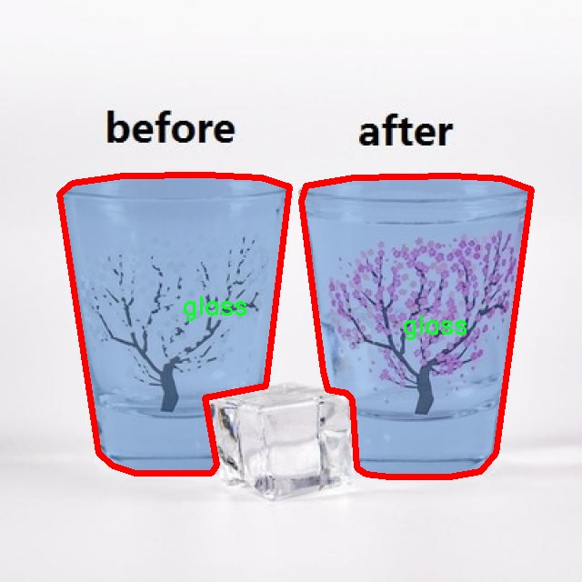

# 垃圾材质分类图像图像分割系统源码＆数据集分享
 [yolov8-seg-swintransformer＆yolov8-seg-GFPN等50+全套改进创新点发刊_一键训练教程_Web前端展示]

### 1.研究背景与意义

项目参考[ILSVRC ImageNet Large Scale Visual Recognition Challenge](https://gitee.com/YOLOv8_YOLOv11_Segmentation_Studio/projects)

项目来源[AAAI Global Al lnnovation Contest](https://kdocs.cn/l/cszuIiCKVNis)

研究背景与意义

随着城市化进程的加快和人们生活水平的提高，垃圾产生量逐年上升，垃圾分类已成为现代社会可持续发展的重要环节。有效的垃圾分类不仅能够减少环境污染，还能促进资源的回收利用，推动循环经济的发展。因此，构建一个高效、准确的垃圾材质分类系统显得尤为重要。传统的垃圾分类方法多依赖人工识别，不仅效率低下，而且容易受到人为因素的影响，导致分类错误率较高。近年来，计算机视觉技术的快速发展为垃圾分类提供了新的解决方案，尤其是深度学习技术在图像识别和分割领域的应用，极大地提升了分类的准确性和效率。

在众多深度学习模型中，YOLO（You Only Look Once）系列模型因其实时性和高精度而受到广泛关注。YOLOv8作为该系列的最新版本，结合了多种先进的特征提取和处理技术，能够在复杂环境中快速识别和分类目标。然而，现有的YOLOv8模型在垃圾材质分类任务中仍存在一些不足之处，例如对不同材质的细微差别识别能力不足、对背景复杂场景的适应性较差等。因此，基于改进YOLOv8的垃圾材质分类图像分割系统的研究具有重要的现实意义。

本研究将基于4800张图像的数据集，涵盖金属、玻璃、纸张和塑料等五类垃圾材质，利用实例分割技术对图像进行处理。该数据集的多样性和丰富性为模型的训练提供了良好的基础，能够有效提升模型的泛化能力。通过对YOLOv8模型的改进，增强其在特定垃圾材质分类中的表现，我们希望能够实现更高的分类精度和更快的处理速度。此外，实例分割技术的引入，将使得模型不仅能够识别垃圾的种类，还能准确地分割出每个物体的轮廓，为后续的自动化垃圾处理提供更为精准的数据支持。

本研究的意义不仅在于技术层面的创新，更在于其对社会环境的积极影响。通过构建高效的垃圾材质分类系统，我们能够为城市垃圾管理提供智能化解决方案，减少人工成本，提高垃圾分类的准确性，进而推动资源的有效回收与利用。同时，研究成果还可以为相关领域的学术研究提供参考，促进计算机视觉技术在环境保护和资源管理中的应用。综上所述，基于改进YOLOv8的垃圾材质分类图像分割系统的研究，不仅具有重要的学术价值，也将为社会的可持续发展贡献一份力量。

### 2.图片演示


##### 注意：由于此博客编辑较早，上面“2.图片演示”和“3.视频演示”展示的系统图片或者视频可能为老版本，新版本在老版本的基础上升级如下：（实际效果以升级的新版本为准）

  （1）适配了YOLOV8的“目标检测”模型和“实例分割”模型，通过加载相应的权重（.pt）文件即可自适应加载模型。

  （2）支持“图片识别”、“视频识别”、“摄像头实时识别”三种识别模式。

  （3）支持“图片识别”、“视频识别”、“摄像头实时识别”三种识别结果保存导出，解决手动导出（容易卡顿出现爆内存）存在的问题，识别完自动保存结果并导出到tempDir中。

  （4）支持Web前端系统中的标题、背景图等自定义修改，后面提供修改教程。

  另外本项目提供训练的数据集和训练教程,暂不提供权重文件（best.pt）,需要您按照教程进行训练后实现图片演示和Web前端界面演示的效果。

### 3.视频演示

[3.1 视频演示](https://www.bilibili.com/video/BV1d1DAYiEsB/)

### 4.数据集信息展示

##### 4.1 本项目数据集详细数据（类别数＆类别名）

nc: 4
names: ['glass', 'metal', 'paper', 'plastic']


##### 4.2 本项目数据集信息介绍

数据集信息展示

在现代计算机视觉领域，图像分割技术在物体识别和分类中扮演着至关重要的角色。为了推动这一领域的发展，我们构建了一个名为“trashsegmentation”的数据集，旨在为改进YOLOv8-seg的垃圾材质分类图像分割系统提供高质量的训练数据。该数据集专注于垃圾分类的细分领域，涵盖了四种主要的垃圾材质类别：玻璃、金属、纸张和塑料。这四种类别不仅在日常生活中普遍存在，而且在垃圾回收和环境保护中具有重要的意义。

“trashsegmentation”数据集的设计初衷是为了解决当前垃圾分类系统中存在的多样性和复杂性问题。随着城市化进程的加快，垃圾的种类和数量日益增加，传统的垃圾分类方法往往无法满足高效、准确的需求。因此，基于深度学习的图像分割技术应运而生，通过对图像进行像素级的分类，使得不同材质的垃圾能够被精确识别和分离，从而提高回收效率，减少环境污染。

该数据集包含了大量高质量的图像，经过精心标注，确保每一张图像都能为模型的训练提供准确的信息。每个类别的图像都涵盖了不同的场景和光照条件，以增强模型的泛化能力。例如，玻璃类别的图像不仅包括透明的饮料瓶，还涵盖了各种颜色的玻璃容器；金属类别则包含了铝罐、铁罐等多种形式的金属垃圾；纸张类别则包括了报纸、纸箱和其他纸制品；而塑料类别则涉及了各种塑料瓶、袋子和包装材料。这种多样性使得“trashsegmentation”数据集在训练过程中能够更好地模拟真实世界中的垃圾分类场景。

在数据集的构建过程中，我们特别关注了图像的质量和标注的准确性。每一张图像都经过严格筛选，确保其清晰度和可用性。同时，标注工作由经验丰富的团队完成，采用了先进的标注工具，以确保每个物体的边界都被精确勾勒。这种高质量的标注不仅有助于提升模型的训练效果，还能在实际应用中提高分类的准确率。

通过使用“trashsegmentation”数据集，研究人员和开发者可以有效地训练和优化YOLOv8-seg模型，使其在垃圾材质分类任务中表现出色。该数据集的发布将为垃圾分类的自动化和智能化提供坚实的基础，推动相关技术的进步与应用。同时，随着社会对环保意识的增强，垃圾分类的研究和应用也将迎来新的机遇和挑战。

总之，“trashsegmentation”数据集的推出，不仅为垃圾材质分类的研究提供了宝贵的数据支持，也为未来的环境保护和可持续发展贡献了一份力量。希望通过这一数据集的广泛应用，能够推动垃圾分类技术的不断进步，最终实现更高效的资源回收和环境保护目标。





### 5.全套项目环境部署视频教程（零基础手把手教学）

[5.1 环境部署教程链接（零基础手把手教学）](https://www.bilibili.com/video/BV1jG4Ve4E9t/?vd_source=bc9aec86d164b67a7004b996143742dc)


[5.2 安装Python虚拟环境创建和依赖库安装视频教程链接（零基础手把手教学）](https://www.bilibili.com/video/BV1nA4VeYEze/?vd_source=bc9aec86d164b67a7004b996143742dc)

### 6.手把手YOLOV8-seg训练视频教程（零基础小白有手就能学会）

[6.1 手把手YOLOV8-seg训练视频教程（零基础小白有手就能学会）](https://www.bilibili.com/video/BV1cA4VeYETe/?vd_source=bc9aec86d164b67a7004b996143742dc)


按照上面的训练视频教程链接加载项目提供的数据集，运行train.py即可开始训练



     Epoch   gpu_mem       box       obj       cls    labels  img_size
     1/200     0G   0.01576   0.01955  0.007536        22      1280: 100%|██████████| 849/849 [14:42<00:00,  1.04s/it]
               Class     Images     Labels          P          R     mAP@.5 mAP@.5:.95: 100%|██████████| 213/213 [01:14<00:00,  2.87it/s]
                 all       3395      17314      0.994      0.957      0.0957      0.0843

     Epoch   gpu_mem       box       obj       cls    labels  img_size
     2/200     0G   0.01578   0.01923  0.007006        22      1280: 100%|██████████| 849/849 [14:44<00:00,  1.04s/it]
               Class     Images     Labels          P          R     mAP@.5 mAP@.5:.95: 100%|██████████| 213/213 [01:12<00:00,  2.95it/s]
                 all       3395      17314      0.996      0.956      0.0957      0.0845

     Epoch   gpu_mem       box       obj       cls    labels  img_size
     3/200     0G   0.01561    0.0191  0.006895        27      1280: 100%|██████████| 849/849 [10:56<00:00,  1.29it/s]
               Class     Images     Labels          P          R     mAP@.5 mAP@.5:.95: 100%|███████   | 187/213 [00:52<00:00,  4.04it/s]
                 all       3395      17314      0.996      0.957      0.0957      0.0845


### 7.50+种全套YOLOV8-seg创新点代码加载调参视频教程（一键加载写好的改进模型的配置文件）

[7.1 50+种全套YOLOV8-seg创新点代码加载调参视频教程（一键加载写好的改进模型的配置文件）](https://www.bilibili.com/video/BV1Hw4VePEXv/?vd_source=bc9aec86d164b67a7004b996143742dc)

### 8.YOLOV8-seg图像分割算法原理

原始YOLOv8-seg算法原理

YOLOv8-seg算法是Ultralytics公司在2023年推出的目标检测与图像分割的前沿技术，代表了YOLO系列算法的又一次重大进步。相较于前几代版本，YOLOv8-seg不仅在目标检测的准确性和速度上进行了优化，还在图像分割任务中展现了更强的能力。该算法的设计理念是以快速、准确和易于使用为核心，旨在满足各种实际应用场景的需求，如智能监控、自动驾驶、医疗影像分析等。

YOLOv8-seg的网络结构可以分为几个主要部分：输入层、主干网络（Backbone）、特征融合层（Neck）和输出层（Head）。首先，在输入层，YOLOv8-seg默认接受640x640像素的图像，但为了适应不同长宽比的图像，算法采用了自适应缩放技术。这种技术通过将图像的长边缩放到指定尺寸，并对短边进行填充，从而最大限度地减少信息冗余，提升目标检测和推理的速度。此外，在训练过程中，YOLOv8-seg引入了Mosaic增强技术，这一技术通过随机拼接四张不同的图像，形成新的训练样本，使得模型能够学习到更多的上下文信息和不同的物体位置，从而提高了模型的泛化能力和预测精度。

在主干网络部分，YOLOv8-seg对YOLOv5中的C3模块进行了替换，采用了C2F模块。这一模块的设计灵感来源于YOLOv7中的ELAN模块，通过并行更多的梯度流分支，C2F模块不仅保持了模型的轻量化，还有效地提升了特征提取的精度和效率。与C3模块相比，C2F模块在结构上更加灵活，能够适应不同规模的模型需求，并且在特征提取过程中提供了更丰富的梯度信息。

特征融合层（Neck）是YOLOv8-seg的重要组成部分，它的设计目的是将来自主干网络的不同阶段输出的特征进行有效融合。YOLOv8-seg在这一部分去除了多余的卷积层，直接对特征进行上采样处理，这种简化的结构不仅提高了计算效率，还增强了特征融合的效果。通过引入特征金字塔网络（FPN）和路径聚合网络（PAN），YOLOv8-seg能够在不同尺度上有效地提取特征信息，进一步提升了模型在复杂场景下的表现。

在输出层，YOLOv8-seg的设计变化最为显著。与YOLOv5的耦合头（Coupled-Head）不同，YOLOv8-seg采用了解耦头（Decoupled-Head）结构。这个结构将目标检测和分类任务分开处理，分别通过两个独立的卷积模块进行类别预测和边界框回归。这种解耦设计使得模型在处理复杂场景时，能够更专注于每个任务的特征学习，提升了整体的检测精度。同时，YOLOv8-seg在损失函数的设计上也进行了创新，取消了传统的目标分支，采用了更为高效的分布焦点损失（DFL）和CIoU损失，以快速聚焦于标签附近的区域，提升了模型的收敛速度和精度。

值得注意的是，YOLOv8-seg摒弃了以往的基于锚框（Anchor-Based）的方法，转而采用无锚框（Anchor-Free）的方法。这一转变使得目标检测的过程更加灵活，不再依赖于预设的锚框，从而减少了计算复杂度，并提高了模型在不同数据集上的泛化能力。通过将目标检测转化为关键点检测，YOLOv8-seg能够在不需要进行锚框聚类的情况下，直接对目标进行定位和分类，极大地简化了模型的设计。

YOLOv8-seg的整体架构和设计理念，体现了对目标检测和图像分割任务的深刻理解与创新。通过引入多种新技术和优化策略，YOLOv8-seg在精度和速度上均表现出色，成为了当前图像处理领域的重要工具。其轻量化的设计和高效的特征提取能力，使得YOLOv8-seg能够在实时应用中发挥重要作用，满足现代计算机视觉任务的需求。无论是在智能监控、自动驾驶还是其他复杂场景下，YOLOv8-seg都展现出了其强大的应用潜力，预示着目标检测与图像分割技术的未来发展方向。


### 9.系统功能展示（检测对象为举例，实际内容以本项目数据集为准）

图9.1.系统支持检测结果表格显示

  图9.2.系统支持置信度和IOU阈值手动调节

  图9.3.系统支持自定义加载权重文件best.pt(需要你通过步骤5中训练获得)

  图9.4.系统支持摄像头实时识别

  图9.5.系统支持图片识别

  图9.6.系统支持视频识别

  图9.7.系统支持识别结果文件自动保存

  图9.8.系统支持Excel导出检测结果数据


### 10.50+种全套YOLOV8-seg创新点原理讲解（非科班也可以轻松写刊发刊，V11版本正在科研待更新）

#### 10.1 由于篇幅限制，每个创新点的具体原理讲解就不一一展开，具体见下列网址中的创新点对应子项目的技术原理博客网址【Blog】：


[10.1 50+种全套YOLOV8-seg创新点原理讲解链接](https://gitee.com/qunmasj/good)

#### 10.2 部分改进模块原理讲解(完整的改进原理见上图和技术博客链接)【如果此小节的图加载失败可以通过CSDN或者Github搜索该博客的标题访问原始博客，原始博客图片显示正常】

### YOLOv8简介


由上图可以看出，C2中每个BottlNeck的输入Tensor的通道数channel都只是上一级的0.5倍，因此计算量明显降低。从另一方面讲，梯度流的增加，t也能够明显提升收敛速度和收敛效果。
C2i模块首先以输入tensor(n.c.h.w)经过Conv1层进行split拆分，分成两部分(n,0.5c,h,w)，一部分直接经过n个Bottlenck，另一部分经过每一操作层后都会以(n.0.5c,h,w)的尺寸进行Shortcut，最后通过Conv2层卷积输出。也就是对应n+2的Shortcut(第一层Conv1的分支tensor和split后的tensor为2+n个bottenlenneck)。
#### Neck
YOLOv8的Neck采用了PANet结构，如下图所示。

Backbone最后SPPF模块(Layer9)之后H、W经过32倍下采样，对应地Layer4经过8倍下采样，Layer6经过16倍下采样。输入图片分辨率为640*640，得到Layer4、Layer6、Layer9的分辨率分别为80*80、40*40和20*20。
Layer4、Layer6、Layer9作为PANet结构的输入，经过上采样，通道融合，最终将PANet的三个输出分支送入到Detect head中进行Loss的计算或结果解算。
与FPN(单向，自上而下)不同的是，PANet是一个双向通路网络，引入了自下向上的路径，使得底层信息更容易传递到顶层。
#### Head
Head部分相比Yolov5改动较大，直接将耦合头改为类似Yolo的解耦头结构(Decoupled-Head)，将回归分支和预测分支分离，并针对回归分支使用了Distribution Focal Loss策略中提出的积分形式表示法。之前的目标检测网络将回归坐标作为一个确定性单值进行预测，DFL将坐标转变成一个分布。


### LSKNet的架构
该博客提出的结构层级依次为：

LSK module（大核卷积序列+空间选择机制） < LSK Block （LK Selection + FFN）<LSKNet（N个LSK Block）


#### LSK 模块

LSK Block
LSKNet 是主干网络中的一个可重复堆叠的块（Block），每个LSK Block包括两个残差子块，即大核选择子块（Large Kernel Selection，LK Selection）和前馈网络子块（Feed-forward Network ，FFN），如图8。LK Selection子块根据需要动态地调整网络的感受野，FFN子块用于通道混合和特征细化，由一个全连接层、一个深度卷积、一个 GELU 激活和第二个全连接层组成。

LSK module（LSK 模块，图4）由一个大核卷积序列（large kernel convolutions）和一个空间核选择机制（spatial kernel selection mechanism）组成，被嵌入到了LSK Block 的 LK Selection子块中。

#### Large Kernel Convolutions
因为不同类型的目标对背景信息的需求不同，这就需要模型能够自适应选择不同大小的背景范围。因此，作者通过解耦出一系列具有大卷积核、且不断扩张的Depth-wise 卷积，构建了一个更大感受野的网络。

具体地，假设序列中第i个Depth-wise 卷积核的大小为 ，扩张率为 d，感受野为 ，它们满足以下关系：


卷积核大小和扩张率的增加保证了感受野能够快速增大。此外，我们设置了扩张率的上限，以保证扩张卷积不会引入特征图之间的差距。


Table2的卷积核大小可根据公式（1）和（2）计算，详见下图：


这样设计的好处有两点。首先，能够产生具有多种不同大小感受野的特征，便于后续的核选择；第二，序列解耦比简单的使用一个大型卷积核效果更好。如上图表2所示，解耦操作相对于标准的大型卷积核，有效地将低了模型的参数量。

为了从输入数据  的不同区域获取丰富的背景信息特征，可采用一系列解耦的、不用感受野的Depth-wise 卷积核：


其中，是卷积核为 、扩张率为  的Depth-wise 卷积操作。假设有个解耦的卷积核，每个卷积操作后又要经过一个的卷积层进行空间特征向量的通道融合。


之后，针对不同的目标，可基于获取的多尺度特征，通过下文中的选择机制动态选择合适的卷积核大小。

这一段的意思可以简单理解为：

把一个大的卷积核拆成了几个小的卷积核，比如一个大小为5，扩张率为1的卷积核加上一个大小为7，扩张率为3的卷积核，感受野为23，与一个大小为23，扩张率为1的卷积核的感受野是一样的。因此可用两个小的卷积核替代一个大的卷积核，同理一个大小为29的卷积核也可以用三个小的卷积代替（Table 2），这样可以有效的减少参数，且更灵活。

将输入数据依次通过这些小的卷积核（公式3），并在每个小的卷积核后面接上一个1×1的卷积进行通道融合（公式4）。

#### Spatial Kernel Selection
为了使模型更关注目标在空间上的重点背景信息，作者使用空间选择机制从不同尺度的大卷积核中对特征图进行空间选择。

首先，将来自于不同感受野卷积核的特征进行concate拼接，然后，应用通道级的平均池化和最大池化提取空间关系，其中， 和  是平均池化和最大池化后的空间特征描述符。为了实现不同空间描述符的信息交互，作者利用卷积层将空间池化特征进行拼接，将2个通道的池化特征转换为N个空间注意力特征图，之后，将Sigmoid激活函数应用到每一个空间注意力特征图，可获得每个解耦的大卷积核所对应的独立的空间选择掩膜，又然后，将解耦后的大卷积核序列的特征与对应的空间选择掩膜进行加权处理，并通过卷积层进行融合获得注意力特征 ，最后LSK module的输出可通过输入特征  与注意力特征  的逐元素点成获得，公式对应于结构图上的操作如下：


### 11.项目核心源码讲解（再也不用担心看不懂代码逻辑）

#### 11.1 ultralytics\trackers\bot_sort.py

以下是对代码中最核心部分的分析和详细注释：

```python
# Ultralytics YOLO 🚀, AGPL-3.0 license

from collections import deque
import numpy as np
from .basetrack import TrackState
from .byte_tracker import BYTETracker, STrack
from .utils import matching
from .utils.gmc import GMC
from .utils.kalman_filter import KalmanFilterXYWH

class BOTrack(STrack):
    """
    BOTrack类是STrack类的扩展，添加了对象跟踪功能。
    """

    # 共享的卡尔曼滤波器实例
    shared_kalman = KalmanFilterXYWH()

    def __init__(self, tlwh, score, cls, feat=None, feat_history=50):
        """
        初始化BOTrack实例，设置目标的初始参数。
        
        参数:
        tlwh: 目标的边界框信息 (top left x, top left y, width, height)
        score: 目标的置信度分数
        cls: 目标的类别
        feat: 目标的特征向量（可选）
        feat_history: 特征历史记录的最大长度
        """
        super().__init__(tlwh, score, cls)
        self.smooth_feat = None  # 平滑后的特征向量
        self.curr_feat = None  # 当前特征向量
        if feat is not None:
            self.update_features(feat)  # 更新特征
        self.features = deque([], maxlen=feat_history)  # 存储特征向量的双端队列
        self.alpha = 0.9  # 平滑因子

    def update_features(self, feat):
        """
        更新特征向量，并使用指数移动平均进行平滑。
        
        参数:
        feat: 新的特征向量
        """
        feat /= np.linalg.norm(feat)  # 归一化特征向量
        self.curr_feat = feat  # 更新当前特征
        if self.smooth_feat is None:
            self.smooth_feat = feat  # 如果没有平滑特征，则直接赋值
        else:
            # 使用指数移动平均平滑特征
            self.smooth_feat = self.alpha * self.smooth_feat + (1 - self.alpha) * feat
        self.features.append(feat)  # 将新特征添加到历史特征中
        self.smooth_feat /= np.linalg.norm(self.smooth_feat)  # 归一化平滑特征

    def predict(self):
        """
        使用卡尔曼滤波器预测目标的状态（均值和协方差）。
        """
        mean_state = self.mean.copy()  # 复制当前均值状态
        if self.state != TrackState.Tracked:
            mean_state[6] = 0  # 如果状态不是跟踪状态，重置速度
            mean_state[7] = 0

        # 预测新的均值和协方差
        self.mean, self.covariance = self.kalman_filter.predict(mean_state, self.covariance)

    @property
    def tlwh(self):
        """
        获取当前目标的位置，以边界框格式返回 (top left x, top left y, width, height)。
        """
        if self.mean is None:
            return self._tlwh.copy()  # 如果均值为None，返回初始边界框
        ret = self.mean[:4].copy()  # 复制均值的前四个元素
        ret[:2] -= ret[2:] / 2  # 计算左上角坐标
        return ret

    @staticmethod
    def multi_predict(stracks):
        """
        使用共享的卡尔曼滤波器预测多个对象的状态（均值和协方差）。
        
        参数:
        stracks: 目标跟踪列表
        """
        if len(stracks) <= 0:
            return
        multi_mean = np.asarray([st.mean.copy() for st in stracks])  # 获取所有目标的均值
        multi_covariance = np.asarray([st.covariance for st in stracks])  # 获取所有目标的协方差
        for i, st in enumerate(stracks):
            if st.state != TrackState.Tracked:
                multi_mean[i][6] = 0  # 重置速度
                multi_mean[i][7] = 0
        # 使用共享的卡尔曼滤波器进行多目标预测
        multi_mean, multi_covariance = BOTrack.shared_kalman.multi_predict(multi_mean, multi_covariance)
        for i, (mean, cov) in enumerate(zip(multi_mean, multi_covariance)):
            stracks[i].mean = mean  # 更新目标的均值
            stracks[i].covariance = cov  # 更新目标的协方差

class BOTSORT(BYTETracker):
    """
    BOTSORT类是BYTETracker类的扩展，设计用于YOLOv8的对象跟踪，支持ReID和GMC算法。
    """

    def __init__(self, args, frame_rate=30):
        """
        初始化BOTSORT实例，设置ReID模块和GMC算法。
        
        参数:
        args: 命令行参数，包含跟踪参数
        frame_rate: 帧率
        """
        super().__init__(args, frame_rate)
        self.proximity_thresh = args.proximity_thresh  # 空间接近阈值
        self.appearance_thresh = args.appearance_thresh  # 外观相似性阈值
        self.encoder = None if args.with_reid else None  # ReID模块
        self.gmc = GMC(method=args.gmc_method)  # GMC算法实例

    def init_track(self, dets, scores, cls, img=None):
        """
        使用检测结果、分数和类别初始化跟踪。
        
        参数:
        dets: 检测的边界框
        scores: 检测的分数
        cls: 检测的类别
        img: 输入图像（可选）
        """
        if len(dets) == 0:
            return []
        if self.args.with_reid and self.encoder is not None:
            features_keep = self.encoder.inference(img, dets)  # 获取ReID特征
            return [BOTrack(xyxy, s, c, f) for (xyxy, s, c, f) in zip(dets, scores, cls, features_keep)]
        else:
            return [BOTrack(xyxy, s, c) for (xyxy, s, c) in zip(dets, scores, cls)]

    def get_dists(self, tracks, detections):
        """
        计算跟踪目标与检测目标之间的距离，使用IoU和（可选的）ReID嵌入。
        
        参数:
        tracks: 当前跟踪的目标
        detections: 当前检测的目标
        """
        dists = matching.iou_distance(tracks, detections)  # 计算IoU距离
        dists_mask = (dists > self.proximity_thresh)  # 生成距离掩码

        # 计算融合分数
        dists = matching.fuse_score(dists, detections)

        if self.args.with_reid and self.encoder is not None:
            emb_dists = matching.embedding_distance(tracks, detections) / 2.0  # 计算ReID嵌入距离
            emb_dists[emb_dists > self.appearance_thresh] = 1.0  # 超过阈值的距离设为1
            emb_dists[dists_mask] = 1.0  # 应用距离掩码
            dists = np.minimum(dists, emb_dists)  # 取最小值
        return dists

    def multi_predict(self, tracks):
        """
        使用YOLOv8模型预测和跟踪多个对象。
        
        参数:
        tracks: 当前跟踪的目标列表
        """
        BOTrack.multi_predict(tracks)  # 调用BOTrack的多目标预测方法
```

### 代码核心部分分析
1. **BOTrack类**：负责管理每个目标的状态，包括特征更新、卡尔曼滤波预测和状态重激活等功能。
2. **特征更新**：通过`update_features`方法对目标的特征进行更新和平滑处理，以提高跟踪的稳定性。
3. **预测功能**：使用卡尔曼滤波器对目标的状态进行预测，确保在目标丢失或状态不确定时能够进行合理的估计。
4. **BOTSORT类**：扩展了BYTETracker，添加了ReID和GMC算法的支持，负责初始化跟踪和计算目标之间的距离。
5. **距离计算**：`get_dists`方法结合了IoU和ReID特征，确保目标之间的匹配更加准确。

以上是对代码的核心部分的分析和详细注释，涵盖了类的功能、方法的用途以及关键参数的解释。

这个文件是Ultralytics YOLOv8项目中的一个对象跟踪模块，主要实现了BOTrack和BOTSORT两个类，用于增强YOLOv8在对象跟踪方面的能力。

BOTrack类是对STrack类的扩展，增加了对象跟踪的特性。它使用了卡尔曼滤波器来预测对象的位置和状态，并通过特征向量的平滑处理来提高跟踪的稳定性。BOTrack类的构造函数初始化了对象的状态，包括边界框位置、置信度、类别和特征历史。update_features方法用于更新特征向量，并使用指数移动平均法进行平滑处理。predict方法则利用卡尔曼滤波器来预测当前状态的均值和协方差。re_activate和update方法用于在跟踪过程中更新对象的状态和特征。tlwh属性提供了当前对象的边界框位置，multi_predict方法可以同时预测多个对象的状态，convert_coords和tlwh_to_xywh方法用于在不同的边界框坐标格式之间进行转换。

BOTSORT类是对BYTETracker类的扩展，旨在实现带有ReID（重识别）和GMC（全局运动一致性）算法的对象跟踪。它的构造函数初始化了一些参数，包括空间接近阈值和外观相似性阈值。init_track方法用于根据检测结果初始化跟踪，get_dists方法计算跟踪对象与检测对象之间的距离，支持使用IoU和ReID嵌入进行距离计算。multi_predict方法则调用BOTrack的multi_predict方法来预测和跟踪多个对象。

总体而言，这个文件通过实现BOTrack和BOTSORT类，增强了YOLOv8在动态场景下的对象跟踪能力，特别是在处理复杂的跟踪任务时，能够利用ReID和GMC算法来提高跟踪的准确性和鲁棒性。

#### 11.2 ultralytics\nn\extra_modules\dynamic_snake_conv.py

以下是代码中最核心的部分，并附上详细的中文注释：

```python
import torch
import torch.nn as nn

class DySnakeConv(nn.Module):
    def __init__(self, inc, ouc, k=3) -> None:
        super().__init__()
        # 初始化三个卷积层
        self.conv_0 = Conv(inc, ouc, k)  # 标准卷积
        self.conv_x = DSConv(inc, ouc, 0, k)  # 沿x轴的动态蛇形卷积
        self.conv_y = DSConv(inc, ouc, 1, k)  # 沿y轴的动态蛇形卷积
    
    def forward(self, x):
        # 前向传播，返回三个卷积的拼接结果
        return torch.cat([self.conv_0(x), self.conv_x(x), self.conv_y(x)], dim=1)

class DSConv(nn.Module):
    def __init__(self, in_ch, out_ch, morph, kernel_size=3, if_offset=True, extend_scope=1):
        """
        动态蛇形卷积
        :param in_ch: 输入通道数
        :param out_ch: 输出通道数
        :param kernel_size: 卷积核大小
        :param extend_scope: 扩展范围（默认1）
        :param morph: 卷积核的形态，分为沿x轴（0）和y轴（1）
        :param if_offset: 是否需要偏移，False时为标准卷积
        """
        super(DSConv, self).__init__()
        # 用于学习可变形偏移的卷积层
        self.offset_conv = nn.Conv2d(in_ch, 2 * kernel_size, 3, padding=1)
        self.bn = nn.BatchNorm2d(2 * kernel_size)  # 批归一化
        self.kernel_size = kernel_size

        # 定义沿x轴和y轴的动态蛇形卷积
        self.dsc_conv_x = nn.Conv2d(
            in_ch,
            out_ch,
            kernel_size=(kernel_size, 1),
            stride=(kernel_size, 1),
            padding=0,
        )
        self.dsc_conv_y = nn.Conv2d(
            in_ch,
            out_ch,
            kernel_size=(1, kernel_size),
            stride=(1, kernel_size),
            padding=0,
        )

        self.gn = nn.GroupNorm(out_ch // 4, out_ch)  # 组归一化
        self.act = Conv.default_act  # 默认激活函数

        self.extend_scope = extend_scope
        self.morph = morph
        self.if_offset = if_offset

    def forward(self, f):
        # 前向传播
        offset = self.offset_conv(f)  # 计算偏移
        offset = self.bn(offset)  # 批归一化
        offset = torch.tanh(offset)  # 将偏移限制在[-1, 1]之间
        input_shape = f.shape
        dsc = DSC(input_shape, self.kernel_size, self.extend_scope, self.morph)  # 初始化DSC对象
        deformed_feature = dsc.deform_conv(f, offset, self.if_offset)  # 进行可变形卷积

        # 根据形态选择相应的卷积
        if self.morph == 0:
            x = self.dsc_conv_x(deformed_feature.type(f.dtype))
        else:
            x = self.dsc_conv_y(deformed_feature.type(f.dtype))
        
        x = self.gn(x)  # 组归一化
        x = self.act(x)  # 激活函数
        return x

class DSC(object):
    def __init__(self, input_shape, kernel_size, extend_scope, morph):
        self.num_points = kernel_size  # 卷积核的点数
        self.width = input_shape[2]  # 输入特征图的宽度
        self.height = input_shape[3]  # 输入特征图的高度
        self.morph = morph  # 卷积核形态
        self.extend_scope = extend_scope  # 偏移范围

        # 定义特征图的形状
        self.num_batch = input_shape[0]  # 批大小
        self.num_channels = input_shape[1]  # 通道数

    def deform_conv(self, input, offset, if_offset):
        # 进行可变形卷积
        y, x = self._coordinate_map_3D(offset, if_offset)  # 计算坐标图
        deformed_feature = self._bilinear_interpolate_3D(input, y, x)  # 双线性插值
        return deformed_feature

    def _coordinate_map_3D(self, offset, if_offset):
        # 计算3D坐标图
        # ...（省略具体实现细节）
        return y_new, x_new  # 返回新的y和x坐标

    def _bilinear_interpolate_3D(self, input_feature, y, x):
        # 进行3D双线性插值
        # ...（省略具体实现细节）
        return outputs  # 返回插值后的输出
```

### 代码核心部分说明：
1. **DySnakeConv 类**：实现了一个动态蛇形卷积的模块，包含标准卷积和沿x、y轴的动态卷积。
2. **DSConv 类**：实现了动态蛇形卷积的具体操作，能够根据输入特征图和偏移量进行卷积。
3. **DSC 类**：负责计算坐标图和进行双线性插值，以实现可变形卷积的效果。

### 重要方法：
- `forward`：定义了前向传播的过程。
- `deform_conv`：实现了可变形卷积的核心逻辑。
- `_coordinate_map_3D` 和 `_bilinear_interpolate_3D`：分别计算坐标图和进行插值操作，确保卷积的动态性和灵活性。

这个程序文件定义了一个动态蛇形卷积（Dynamic Snake Convolution）模块，主要用于深度学习中的卷积操作。文件中包含两个主要的类：`DySnakeConv` 和 `DSConv`，以及一个辅助类 `DSC`。

`DySnakeConv` 类是一个卷积层的组合，构造函数中接收输入通道数 `inc`、输出通道数 `ouc` 和卷积核大小 `k`。在初始化时，它创建了三个卷积层：`conv_0` 是标准卷积，`conv_x` 和 `conv_y` 是动态蛇形卷积，分别沿着 x 轴和 y 轴进行操作。在前向传播中，`forward` 方法将这三个卷积的输出在通道维度上拼接在一起，形成最终的输出。

`DSConv` 类实现了动态蛇形卷积的具体逻辑。构造函数中接收输入通道数、输出通道数、卷积核大小、形态参数和是否需要偏移的标志。它定义了用于学习偏移量的卷积层 `offset_conv`，以及两个方向的卷积层 `dsc_conv_x` 和 `dsc_conv_y`。在前向传播中，首先通过 `offset_conv` 计算偏移量，然后利用 `DSC` 类生成的坐标图进行变形卷积，最后通过对应的卷积层和激活函数处理得到输出。

`DSC` 类是动态蛇形卷积的核心，负责生成坐标图和进行双线性插值。它的构造函数接收输入形状、卷积核大小、扩展范围和形态参数。`_coordinate_map_3D` 方法根据偏移量生成新的坐标图，支持两种形态的卷积（沿 x 轴或 y 轴）。`_bilinear_interpolate_3D` 方法则根据生成的坐标图对输入特征图进行双线性插值，得到变形后的特征图。

整体而言，这个文件实现了一种灵活的卷积操作，能够根据输入特征的形态进行动态调整，从而提升模型的表达能力。通过引入偏移量和变形机制，动态蛇形卷积能够更好地捕捉输入数据中的空间特征。

#### 11.3 ultralytics\models\yolo\segment\val.py

以下是经过简化并添加详细中文注释的核心代码部分：

```python
import torch
import torch.nn.functional as F
from ultralytics.utils import ops
from ultralytics.utils.metrics import SegmentMetrics, box_iou, mask_iou
from ultralytics.utils.plotting import output_to_target, plot_images

class SegmentationValidator:
    """
    SegmentationValidator类用于基于分割模型的验证。
    """

    def __init__(self, dataloader=None, save_dir=None, args=None):
        """初始化SegmentationValidator，设置任务为'segment'，并初始化度量标准。"""
        self.dataloader = dataloader  # 数据加载器
        self.save_dir = save_dir  # 保存目录
        self.args = args  # 参数
        self.metrics = SegmentMetrics(save_dir=self.save_dir)  # 初始化分割度量标准
        self.plot_masks = []  # 用于存储绘图的掩码

    def preprocess(self, batch):
        """预处理批次数据，将掩码转换为浮点型并发送到设备。"""
        batch['masks'] = batch['masks'].to(self.device).float()  # 将掩码转移到设备并转换为浮点型
        return batch

    def postprocess(self, preds):
        """后处理YOLO预测，返回输出检测结果。"""
        # 使用非极大值抑制处理预测结果
        p = ops.non_max_suppression(preds[0], self.args.conf, self.args.iou)
        proto = preds[1][-1] if len(preds[1]) == 3 else preds[1]  # 获取原型
        return p, proto  # 返回处理后的预测和原型

    def update_metrics(self, preds, batch):
        """更新度量标准，计算正确的掩码和边界框。"""
        for si, (pred, proto) in enumerate(zip(preds[0], preds[1])):
            idx = batch['batch_idx'] == si  # 获取当前批次索引
            cls = batch['cls'][idx]  # 获取类别
            bbox = batch['bboxes'][idx]  # 获取边界框
            npr = pred.shape[0]  # 预测数量
            shape = batch['ori_shape'][si]  # 原始形状
            correct_masks = torch.zeros(npr, dtype=torch.bool, device=self.device)  # 初始化正确掩码
            correct_bboxes = torch.zeros(npr, dtype=torch.bool, device=self.device)  # 初始化正确边界框

            if npr == 0:  # 如果没有预测
                continue

            # 处理掩码
            gt_masks = batch['masks'][idx]  # 获取真实掩码
            pred_masks = self.process(proto, pred[:, 6:], pred[:, :4], shape=batch['img'][si].shape[1:])  # 处理预测掩码

            # 计算正确的边界框和掩码
            correct_bboxes = self._process_batch(pred, bbox)  # 处理边界框
            correct_masks = self._process_batch(pred, gt_masks, masks=True)  # 处理掩码

            # 记录统计信息
            self.stats.append((correct_bboxes, correct_masks))

    def _process_batch(self, detections, labels, masks=False):
        """
        返回正确预测矩阵。
        Args:
            detections: 预测结果
            labels: 真实标签
        Returns:
            correct: 正确预测的IoU矩阵
        """
        if masks:
            iou = mask_iou(labels.view(labels.shape[0], -1), detections.view(detections.shape[0], -1))  # 计算掩码IoU
        else:
            iou = box_iou(labels[:, 1:], detections[:, :4])  # 计算边界框IoU

        return self.match_predictions(detections[:, 5], labels[:, 0], iou)  # 匹配预测

    def plot_predictions(self, batch, preds, ni):
        """绘制批次预测结果，包括掩码和边界框。"""
        plot_images(batch['img'], *output_to_target(preds[0]), paths=batch['im_file'], fname=self.save_dir / f'val_batch{ni}_pred.jpg')

    def eval_json(self, stats):
        """返回COCO风格的目标检测评估指标。"""
        # 评估逻辑省略
        return stats
```

### 代码注释说明：
1. **类初始化**：`__init__`方法中初始化了数据加载器、保存目录、参数和度量标准。
2. **预处理**：`preprocess`方法将输入批次中的掩码转换为浮点型并移动到指定设备。
3. **后处理**：`postprocess`方法使用非极大值抑制处理预测结果，返回处理后的预测和原型。
4. **更新度量**：`update_metrics`方法根据预测和真实标签更新度量标准，计算正确的掩码和边界框。
5. **处理批次**：`_process_batch`方法计算预测和真实标签之间的IoU，并返回正确预测的矩阵。
6. **绘制预测**：`plot_predictions`方法用于绘制批次的预测结果，包括掩码和边界框。
7. **评估JSON**：`eval_json`方法用于返回COCO风格的评估指标，具体实现细节省略。

这个程序文件 `val.py` 是用于YOLO（You Only Look Once）模型的分割任务验证的实现。它扩展了 `DetectionValidator` 类，专门用于处理分割模型的验证过程。程序的主要功能包括数据预处理、模型预测、后处理、指标更新、结果保存等。

首先，程序导入了一些必要的库和模块，包括多线程处理、路径操作、NumPy、PyTorch等。接着定义了 `SegmentationValidator` 类，构造函数中初始化了一些属性，如任务类型设置为 'segment'，并创建了用于计算分割指标的 `SegmentMetrics` 实例。

在 `preprocess` 方法中，程序对输入的批次数据进行预处理，将掩码数据转换为浮点数并移动到指定设备上。`init_metrics` 方法则初始化指标，并根据是否需要保存JSON格式的结果选择合适的掩码处理函数。

`get_desc` 方法返回格式化的评估指标描述，方便在输出时显示。`postprocess` 方法对YOLO模型的预测结果进行后处理，使用非极大值抑制（NMS）来过滤预测框，并提取出相关的原型信息。

在 `update_metrics` 方法中，程序根据预测结果和真实标签更新指标。它会处理掩码和边界框的匹配，计算正确的掩码和边界框，并将结果存储到统计信息中。如果需要，还会绘制混淆矩阵。

`finalize_metrics` 方法在所有批次处理完成后设置速度和混淆矩阵，以便于后续的评估。`_process_batch` 方法则用于处理每个批次的检测结果，计算与真实标签的交并比（IoU），并返回正确的预测矩阵。

此外，程序还包含绘制验证样本和预测结果的功能，分别在 `plot_val_samples` 和 `plot_predictions` 方法中实现。它们使用 `plot_images` 函数将图像、标签和掩码可视化，便于检查模型的性能。

在 `pred_to_json` 方法中，程序将预测结果保存为JSON格式，使用RLE（Run-Length Encoding）对掩码进行编码。最后，`eval_json` 方法用于计算COCO风格的目标检测评估指标，利用pycocotools库进行评估，并输出mAP（mean Average Precision）等统计信息。

总体而言，这个文件实现了YOLO分割模型验证的完整流程，从数据预处理到结果评估，涵盖了多个重要的步骤和功能。

#### 11.4 chinese_name_list.py

以下是经过简化和详细注释的核心代码部分：

```python
# -*- coding: utf-8 -*-

# 创建一个字典，键为 'person'，值为中文 '人'
Chinese_name = {'person': "人"}

# 从字典中提取所有值，生成一个列表
Label_list = list(Chinese_name.values())

# 此时 Label_list 变量包含了字典中所有的中文名称
```

### 代码说明：
1. **字典创建**：
   - `Chinese_name` 是一个字典，包含一个键值对，键为 `'person'`，对应的值为中文字符 `"人"`。

2. **列表生成**：
   - `Label_list` 是一个列表，通过 `list(Chinese_name.values())` 从字典中提取所有的值（在本例中只有一个值 `"人"`），并将其存储在列表中。

最终，`Label_list` 将包含字典中所有的中文名称，便于后续的使用。

这个程序文件的名称是 `chinese_name_list.py`，它的主要功能是定义一个包含中文名称的字典，并从中提取出值形成一个列表。

首先，文件的开头有一行注释 `# -*- coding: utf-8 -*-`，这行代码指定了文件的编码格式为 UTF-8，确保能够正确处理中文字符。

接下来，程序定义了一个字典 `Chinese_name`，这个字典的键是 `'person'`，对应的值是 `"人"`。字典是一种以键值对形式存储数据的结构，在这里，它用来将英文单词与其中文翻译关联起来。

然后，程序使用 `list()` 函数将字典 `Chinese_name` 中的所有值提取出来，并将这些值转换成一个列表，赋值给变量 `Label_list`。在这个例子中，`Label_list` 将会是一个包含单个元素的列表，即 `["人"]`。

总的来说，这段代码的功能是创建一个包含中文名称的字典，并从中生成一个列表，便于后续使用。

#### 11.5 ultralytics\utils\tal.py

以下是代码中最核心的部分，并附上详细的中文注释：

```python
import torch
import torch.nn as nn

def select_candidates_in_gts(xy_centers, gt_bboxes, eps=1e-9):
    """
    选择在真实框（gt）中的正锚点中心。

    参数：
        xy_centers (Tensor): 形状为(h*w, 2)的张量，表示锚点的中心坐标。
        gt_bboxes (Tensor): 形状为(b, n_boxes, 4)的张量，表示真实框的坐标。

    返回：
        (Tensor): 形状为(b, n_boxes, h*w)的张量，表示每个真实框内的锚点。
    """
    n_anchors = xy_centers.shape[0]  # 锚点数量
    bs, n_boxes, _ = gt_bboxes.shape  # 批次大小和真实框数量
    lt, rb = gt_bboxes.view(-1, 1, 4).chunk(2, 2)  # 将真实框分为左上角和右下角
    bbox_deltas = torch.cat((xy_centers[None] - lt, rb - xy_centers[None]), dim=2).view(bs, n_boxes, n_anchors, -1)
    return bbox_deltas.amin(3).gt_(eps)  # 返回每个锚点与真实框的最小距离是否大于eps

class TaskAlignedAssigner(nn.Module):
    """
    任务对齐分配器，用于目标检测。

    此类根据任务对齐指标将真实目标（gt）分配给锚点，该指标结合了分类和定位信息。

    属性：
        topk (int): 考虑的最佳候选数量。
        num_classes (int): 目标类别数量。
        alpha (float): 分类组件的alpha参数。
        beta (float): 定位组件的beta参数。
        eps (float): 防止除以零的小值。
    """

    def __init__(self, topk=13, num_classes=80, alpha=1.0, beta=6.0, eps=1e-9):
        """初始化任务对齐分配器对象，设置可调超参数。"""
        super().__init__()
        self.topk = topk
        self.num_classes = num_classes
        self.bg_idx = num_classes  # 背景类别索引
        self.alpha = alpha
        self.beta = beta
        self.eps = eps

    @torch.no_grad()
    def forward(self, pd_scores, pd_bboxes, anc_points, gt_labels, gt_bboxes, mask_gt):
        """
        计算任务对齐分配。

        参数：
            pd_scores (Tensor): 形状为(bs, num_total_anchors, num_classes)的张量，表示锚点的预测分数。
            pd_bboxes (Tensor): 形状为(bs, num_total_anchors, 4)的张量，表示锚点的预测边界框。
            anc_points (Tensor): 形状为(num_total_anchors, 2)的张量，表示锚点的坐标。
            gt_labels (Tensor): 形状为(bs, n_max_boxes, 1)的张量，表示真实框的标签。
            gt_bboxes (Tensor): 形状为(bs, n_max_boxes, 4)的张量，表示真实框的坐标。
            mask_gt (Tensor): 形状为(bs, n_max_boxes, 1)的张量，表示真实框的掩码。

        返回：
            target_labels (Tensor): 形状为(bs, num_total_anchors)的张量，包含目标锚点的标签。
            target_bboxes (Tensor): 形状为(bs, num_total_anchors, 4)的张量，包含目标锚点的边界框。
            target_scores (Tensor): 形状为(bs, num_total_anchors, num_classes)的张量，包含目标锚点的分数。
            fg_mask (Tensor): 形状为(bs, num_total_anchors)的张量，表示前景锚点的掩码。
            target_gt_idx (Tensor): 形状为(bs, num_total_anchors)的张量，表示分配的真实目标索引。
        """
        self.bs = pd_scores.size(0)  # 批次大小
        self.n_max_boxes = gt_bboxes.size(1)  # 最大真实框数量

        if self.n_max_boxes == 0:
            device = gt_bboxes.device
            return (torch.full_like(pd_scores[..., 0], self.bg_idx).to(device), 
                    torch.zeros_like(pd_bboxes).to(device),
                    torch.zeros_like(pd_scores).to(device), 
                    torch.zeros_like(pd_scores[..., 0]).to(device),
                    torch.zeros_like(pd_scores[..., 0]).to(device))

        mask_pos, align_metric, overlaps = self.get_pos_mask(pd_scores, pd_bboxes, gt_labels, gt_bboxes, anc_points, mask_gt)

        target_gt_idx, fg_mask, mask_pos = select_highest_overlaps(mask_pos, overlaps, self.n_max_boxes)

        # 获取目标标签、边界框和分数
        target_labels, target_bboxes, target_scores = self.get_targets(gt_labels, gt_bboxes, target_gt_idx, fg_mask)

        # 归一化
        align_metric *= mask_pos
        pos_align_metrics = align_metric.amax(dim=-1, keepdim=True)  # b, max_num_obj
        pos_overlaps = (overlaps * mask_pos).amax(dim=-1, keepdim=True)  # b, max_num_obj
        norm_align_metric = (align_metric * pos_overlaps / (pos_align_metrics + self.eps)).amax(-2).unsqueeze(-1)
        target_scores = target_scores * norm_align_metric

        return target_labels, target_bboxes, target_scores, fg_mask.bool(), target_gt_idx

    def get_pos_mask(self, pd_scores, pd_bboxes, gt_labels, gt_bboxes, anc_points, mask_gt):
        """获取在真实框内的掩码，形状为(b, max_num_obj, h*w)。"""
        mask_in_gts = select_candidates_in_gts(anc_points, gt_bboxes)  # 获取在真实框内的锚点掩码
        align_metric, overlaps = self.get_box_metrics(pd_scores, pd_bboxes, gt_labels, gt_bboxes, mask_in_gts * mask_gt)  # 获取对齐指标和重叠度
        mask_topk = self.select_topk_candidates(align_metric, topk_mask=mask_gt.expand(-1, -1, self.topk).bool())  # 获取top-k掩码
        mask_pos = mask_topk * mask_in_gts * mask_gt  # 合并所有掩码

        return mask_pos, align_metric, overlaps

    def get_box_metrics(self, pd_scores, pd_bboxes, gt_labels, gt_bboxes, mask_gt):
        """计算给定预测和真实边界框的对齐指标。"""
        na = pd_bboxes.shape[-2]  # 锚点数量
        mask_gt = mask_gt.bool()  # 转换为布尔类型
        overlaps = torch.zeros([self.bs, self.n_max_boxes, na], dtype=pd_bboxes.dtype, device=pd_bboxes.device)  # 初始化重叠度张量
        bbox_scores = torch.zeros([self.bs, self.n_max_boxes, na], dtype=pd_scores.dtype, device=pd_scores.device)  # 初始化边界框分数张量

        ind = torch.zeros([2, self.bs, self.n_max_boxes], dtype=torch.long)  # 2, b, max_num_obj
        ind[0] = torch.arange(end=self.bs).view(-1, 1).expand(-1, self.n_max_boxes)  # b, max_num_obj
        ind[1] = gt_labels.squeeze(-1)  # b, max_num_obj
        bbox_scores[mask_gt] = pd_scores[ind[0], :, ind[1]][mask_gt]  # 获取每个锚点的分数

        # 计算重叠度
        pd_boxes = pd_bboxes.unsqueeze(1).expand(-1, self.n_max_boxes, -1, -1)[mask_gt]
        gt_boxes = gt_bboxes.unsqueeze(2).expand(-1, -1, na, -1)[mask_gt]
        overlaps[mask_gt] = bbox_iou(gt_boxes, pd_boxes, xywh=False, CIoU=True).squeeze(-1).clamp_(0)  # 计算IoU

        align_metric = bbox_scores.pow(self.alpha) * overlaps.pow(self.beta)  # 计算对齐指标
        return align_metric, overlaps

    def get_targets(self, gt_labels, gt_bboxes, target_gt_idx, fg_mask):
        """
        计算正锚点的目标标签、目标边界框和目标分数。

        参数：
            gt_labels (Tensor): 真实框标签，形状为(b, max_num_obj, 1)。
            gt_bboxes (Tensor): 真实框边界框，形状为(b, max_num_obj, 4)。
            target_gt_idx (Tensor): 正锚点分配的真实目标索引，形状为(b, h*w)。
            fg_mask (Tensor): 布尔张量，形状为(b, h*w)，表示正锚点。

        返回：
            (Tuple[Tensor, Tensor, Tensor]): 包含以下张量的元组：
                - target_labels (Tensor): 形状为(b, h*w)，包含正锚点的目标标签。
                - target_bboxes (Tensor): 形状为(b, h*w, 4)，包含正锚点的目标边界框。
                - target_scores (Tensor): 形状为(b, h*w, num_classes)，包含正锚点的目标分数。
        """
        batch_ind = torch.arange(end=self.bs, dtype=torch.int64, device=gt_labels.device)[..., None]
        target_gt_idx = target_gt_idx + batch_ind * self.n_max_boxes  # 计算目标索引
        target_labels = gt_labels.long().flatten()[target_gt_idx]  # 获取目标标签

        target_bboxes = gt_bboxes.view(-1, 4)[target_gt_idx]  # 获取目标边界框

        target_labels.clamp_(0)  # 限制标签范围

        target_scores = torch.zeros((target_labels.shape[0], target_labels.shape[1], self.num_classes),
                                    dtype=torch.int64,
                                    device=target_labels.device)  # 初始化目标分数张量
        target_scores.scatter_(2, target_labels.unsqueeze(-1), 1)  # 将目标标签转换为one-hot编码

        fg_scores_mask = fg_mask[:, :, None].repeat(1, 1, self.num_classes)  # 扩展前景掩码
        target_scores = torch.where(fg_scores_mask > 0, target_scores, 0)  # 仅保留前景分数

        return target_labels, target_bboxes, target_scores
```

### 代码核心部分解释
1. **选择锚点**：`select_candidates_in_gts` 函数用于选择在真实框内的锚点中心，返回一个布尔张量，指示哪些锚点是正样本。
2. **任务对齐分配器**：`TaskAlignedAssigner` 类实现了目标检测中的任务对齐分配逻辑，负责将真实框与锚点进行匹配。
3. **前向传播**：`forward` 方法计算锚点的目标标签、边界框和分数，并进行归一化处理。
4. **获取正样本掩码**：`get_pos_mask` 方法获取在真实框内的正样本掩码，并计算对齐指标。
5. **计算对齐指标**：`get_box_metrics` 方法计算预测边界框与真实框之间的对齐指标和重叠度。
6. **生成目标**：`get_targets` 方法生成正锚点的目标标签、边界框和分数。

通过这些核心部分，代码实现了目标检测中的锚点分配逻辑。

这个程序文件是Ultralytics YOLO（You Only Look Once）模型的一部分，主要实现了与目标检测相关的任务对齐分配器（TaskAlignedAssigner）。该文件包含多个函数和一个类，主要用于将真实目标（ground truth）与锚框（anchor boxes）进行匹配，以便于后续的目标检测任务。

首先，文件导入了必要的库，包括PyTorch及其神经网络模块。接着，通过`check_version`函数检查PyTorch的版本，确保其符合要求。

`select_candidates_in_gts`函数用于选择与真实目标框（gt_bboxes）相匹配的锚框中心（xy_centers）。它计算每个锚框中心与真实目标框的距离，并返回一个布尔张量，指示哪些锚框中心是有效的。

`select_highest_overlaps`函数用于处理当一个锚框被多个真实目标框分配的情况。它选择与每个锚框重叠度最高的真实目标框，并返回相关的索引和掩码。

`TaskAlignedAssigner`类是该文件的核心部分，负责根据任务对齐的度量标准将真实目标分配给锚框。该类的构造函数初始化了一些超参数，包括考虑的最大候选框数量、类别数量以及用于分类和定位的权重参数。

在`forward`方法中，类接收预测的分数、边界框、锚点、真实标签和边界框等信息，并计算任务对齐的分配。该方法首先检查是否有真实目标框，如果没有，则返回默认值。接着，它调用`get_pos_mask`方法获取正样本的掩码，并计算与真实目标框的重叠度。然后，通过`select_highest_overlaps`函数选择具有最高重叠度的目标，并通过`get_targets`方法获取目标标签、边界框和分数。

`get_pos_mask`方法负责生成正样本掩码，并计算对齐度量和重叠度。`get_box_metrics`方法计算预测边界框与真实边界框之间的对齐度量，使用IoU（Intersection over Union）作为度量标准。`select_topk_candidates`方法选择前k个候选框，基于给定的度量进行筛选。

`get_targets`方法则根据分配的真实目标索引生成目标标签、边界框和分数。它将真实目标的标签和边界框映射到锚框上，并返回相应的结果。

此外，文件还定义了一些辅助函数，如`make_anchors`用于生成锚框，`dist2bbox`和`bbox2dist`用于在锚框和边界框之间进行转换。

整体来看，这个文件实现了YOLO模型中目标检测的关键步骤，通过对真实目标和锚框的匹配，帮助模型更好地进行目标检测任务。

### 12.系统整体结构（节选）

### 程序整体功能和构架概括

该程序是Ultralytics YOLO（You Only Look Once）项目的一部分，主要用于目标检测和分割任务。它包含多个模块和文件，各自实现特定的功能，整体构架旨在提高模型的性能和灵活性。主要功能包括：

1. **对象跟踪**：通过 `bot_sort.py` 文件实现了基于BOTSORT算法的对象跟踪，增强了YOLO模型在动态场景下的跟踪能力。
2. **动态卷积**：`dynamic_snake_conv.py` 文件实现了动态蛇形卷积，提升了模型对空间特征的捕捉能力。
3. **分割验证**：`val.py` 文件负责分割模型的验证过程，包括数据预处理、模型预测、后处理和指标评估。
4. **中文名称处理**：`chinese_name_list.py` 文件定义了一个简单的中文名称字典，便于后续使用。
5. **任务对齐分配**：`tal.py` 文件实现了目标检测中的任务对齐分配器，负责将真实目标与锚框进行匹配。

### 文件功能整理表

| 文件路径                                         | 功能描述                                                                                     |
|--------------------------------------------------|----------------------------------------------------------------------------------------------|
| `ultralytics/trackers/bot_sort.py`              | 实现BOTSORT对象跟踪算法，增强YOLO模型在动态场景下的跟踪能力。                              |
| `ultralytics/nn/extra_modules/dynamic_snake_conv.py` | 实现动态蛇形卷积模块，提升模型对空间特征的捕捉能力。                                       |
| `ultralytics/models/yolo/segment/val.py`       | 负责YOLO分割模型的验证过程，包括数据预处理、模型预测、后处理和指标评估。                   |
| `chinese_name_list.py`                           | 定义一个简单的中文名称字典，并生成相应的名称列表。                                          |
| `ultralytics/utils/tal.py`                       | 实现目标检测中的任务对齐分配器，将真实目标与锚框进行匹配，支持目标检测的训练过程。         |

这个表格总结了每个文件的主要功能，帮助理解整个程序的构架和模块间的关系。

注意：由于此博客编辑较早，上面“11.项目核心源码讲解（再也不用担心看不懂代码逻辑）”中部分代码可能会优化升级，仅供参考学习，完整“训练源码”、“Web前端界面”和“50+种创新点源码”以“14.完整训练+Web前端界面+50+种创新点源码、数据集获取”的内容为准。

### 13.图片、视频、摄像头图像分割Demo(去除WebUI)代码

在这个博客小节中，我们将讨论如何在不使用WebUI的情况下，实现图像分割模型的使用。本项目代码已经优化整合，方便用户将分割功能嵌入自己的项目中。
核心功能包括图片、视频、摄像头图像的分割，ROI区域的轮廓提取、类别分类、周长计算、面积计算、圆度计算以及颜色提取等。
这些功能提供了良好的二次开发基础。

### 核心代码解读

以下是主要代码片段，我们会为每一块代码进行详细的批注解释：

```python
import random
import cv2
import numpy as np
from PIL import ImageFont, ImageDraw, Image
from hashlib import md5
from model import Web_Detector
from chinese_name_list import Label_list

# 根据名称生成颜色
def generate_color_based_on_name(name):
    ......

# 计算多边形面积
def calculate_polygon_area(points):
    return cv2.contourArea(points.astype(np.float32))

...
# 绘制中文标签
def draw_with_chinese(image, text, position, font_size=20, color=(255, 0, 0)):
    image_pil = Image.fromarray(cv2.cvtColor(image, cv2.COLOR_BGR2RGB))
    draw = ImageDraw.Draw(image_pil)
    font = ImageFont.truetype("simsun.ttc", font_size, encoding="unic")
    draw.text(position, text, font=font, fill=color)
    return cv2.cvtColor(np.array(image_pil), cv2.COLOR_RGB2BGR)

# 动态调整参数
def adjust_parameter(image_size, base_size=1000):
    max_size = max(image_size)
    return max_size / base_size

# 绘制检测结果
def draw_detections(image, info, alpha=0.2):
    name, bbox, conf, cls_id, mask = info['class_name'], info['bbox'], info['score'], info['class_id'], info['mask']
    adjust_param = adjust_parameter(image.shape[:2])
    spacing = int(20 * adjust_param)

    if mask is None:
        x1, y1, x2, y2 = bbox
        aim_frame_area = (x2 - x1) * (y2 - y1)
        cv2.rectangle(image, (x1, y1), (x2, y2), color=(0, 0, 255), thickness=int(3 * adjust_param))
        image = draw_with_chinese(image, name, (x1, y1 - int(30 * adjust_param)), font_size=int(35 * adjust_param))
        y_offset = int(50 * adjust_param)  # 类别名称上方绘制，其下方留出空间
    else:
        mask_points = np.concatenate(mask)
        aim_frame_area = calculate_polygon_area(mask_points)
        mask_color = generate_color_based_on_name(name)
        try:
            overlay = image.copy()
            cv2.fillPoly(overlay, [mask_points.astype(np.int32)], mask_color)
            image = cv2.addWeighted(overlay, 0.3, image, 0.7, 0)
            cv2.drawContours(image, [mask_points.astype(np.int32)], -1, (0, 0, 255), thickness=int(8 * adjust_param))

            # 计算面积、周长、圆度
            area = cv2.contourArea(mask_points.astype(np.int32))
            perimeter = cv2.arcLength(mask_points.astype(np.int32), True)
            ......

            # 计算色彩
            mask = np.zeros(image.shape[:2], dtype=np.uint8)
            cv2.drawContours(mask, [mask_points.astype(np.int32)], -1, 255, -1)
            color_points = cv2.findNonZero(mask)
            ......

            # 绘制类别名称
            x, y = np.min(mask_points, axis=0).astype(int)
            image = draw_with_chinese(image, name, (x, y - int(30 * adjust_param)), font_size=int(35 * adjust_param))
            y_offset = int(50 * adjust_param)

            # 绘制面积、周长、圆度和色彩值
            metrics = [("Area", area), ("Perimeter", perimeter), ("Circularity", circularity), ("Color", color_str)]
            for idx, (metric_name, metric_value) in enumerate(metrics):
                ......

    return image, aim_frame_area

# 处理每帧图像
def process_frame(model, image):
    pre_img = model.preprocess(image)
    pred = model.predict(pre_img)
    det = pred[0] if det is not None and len(det)
    if det:
        det_info = model.postprocess(pred)
        for info in det_info:
            image, _ = draw_detections(image, info)
    return image

if __name__ == "__main__":
    cls_name = Label_list
    model = Web_Detector()
    model.load_model("./weights/yolov8s-seg.pt")

    # 摄像头实时处理
    cap = cv2.VideoCapture(0)
    while cap.isOpened():
        ret, frame = cap.read()
        if not ret:
            break
        ......

    # 图片处理
    image_path = './icon/OIP.jpg'
    image = cv2.imread(image_path)
    if image is not None:
        processed_image = process_frame(model, image)
        ......

    # 视频处理
    video_path = ''  # 输入视频的路径
    cap = cv2.VideoCapture(video_path)
    while cap.isOpened():
        ret, frame = cap.read()
        ......
```


### 14.完整训练+Web前端界面+50+种创新点源码、数据集获取


# [下载链接：https://mbd.pub/o/bread/Zp6blp5r](https://mbd.pub/o/bread/Zp6blp5r)